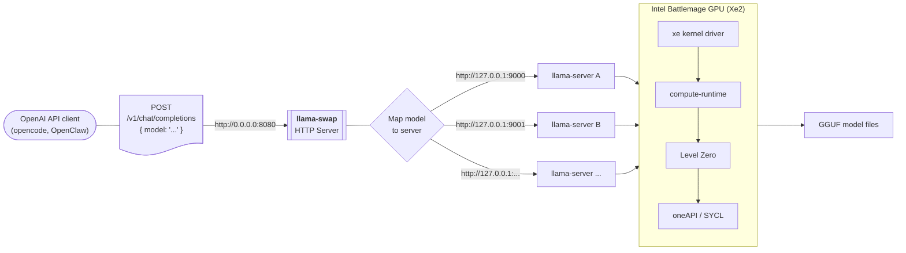

# Intel Battlemage GPU Local LLM Stack

Single-port OpenAI-compatible chat-completions endpoint, backed by `llama.cpp` (SYCL/Level-Zero → XMX) and fronted by `llama-swap` for transparent model switching on an Intel Battlemage (Xe2) GPU.

## Compatibility

This stack is designed to work with any Intel Battlemage (Xe2) GPU, though it has only been tested on the Arc Pro B70.

| GPU | Compatible |
|---|---|
| Intel® Arc™ B570 Graphics | ⚠️ untested |
| Intel® Arc™ B580 Graphics | ⚠️ untested |
| Intel® Arc™ Pro B50 Graphics | ⚠️ untested |
| Intel® Arc™ Pro B60 Graphics | ⚠️ untested |
| Intel® Arc™ Pro B65 Graphics | ⚠️ untested |
| Intel® Arc™ Pro B70 Graphics | ✅ verified |

This stack is fully compatible with GPU passthrough to a VM. It has been tested on Ubuntu 24.04 running as a Proxmox LXC/container and VM with the Battlemage GPU passed through via PCI passthrough (VFIO). Ensure IOMMU is enabled in your host BIOS and that the GPU is properly bound to the VFIO driver before being assigned to the guest. The `01-install-firmware.sh` script includes a check for the `renderD128` device node and will advise a reboot if it's missing after driver load — this is common after initial VM setup with GPU passthrough.

## Architecture

The base architecture of this solution is an llama-swap server that proxies requests to backend llama-servers hosting models on the Xe2 GPU.  This allows any OpenAI compatible client to query llama-swap to load any available model.


One or more swap groups can be defined in llama-swap and each group can host one or more models.  Models within the same group swap in and out of VRAM on demand. Models in different groups can run simultaneously (controlled by the `exclusive` setting in `llama-swap.yaml`). First request to a cold model triggers a load (~20–30 s for a 27B model); subsequent requests stay warm. Loaded models go idle and unload if no traffic after the timeout period specified in the service setup script.

GGUFs live under `$MODELS_DIR` (default: `~/.lmstudio/models/`) so LM Studio sees them too — both stacks coexist. Use LM Studio or any other tool to download models, then run scripts 03 and 04 to register them.

## Workflow

**Initial setup** (run once per machine):
1. `01-install-firmware.sh` — firmware, driver, permissions
2. `02-build-compute-stack.sh` — Intel compute stack + llama.cpp build

**Add or update models** (run any time after initial setup):
1. Drop GGUF files into `$MODELS_DIR` (default: `~/.lmstudio/models/`) (e.g., via LM Studio)
2. `bash 03-discover-models.sh` — generates per-model params from `llama.cpp.params.defaults`
3. `bash 04-setup-service.sh` — builds `llama-swap.yaml`, configs, starts the service

Scripts 03 and 04 are idempotent: safe to re-run whenever your model library changes. Script 03 skips existing `.params` files, so per-model customizations are preserved. Both scripts skip models that have a corresponding `.ignore` file next to their GGUF.

## Quick Start

Run the four scripts in order on Ubuntu 24.04+ with kernel ≥ 6.8 (≥ 6.17 preferred) and a Battlemage GPU visible to `lspci`:

```bash
# 1. Install xe firmware, load driver, set permissions
sudo bash 01-install-firmware.sh

# 2. Install Intel compute-runtime, oneAPI, build llama.cpp with SYCL
bash 02-build-compute-stack.sh

# 3. Auto-discover GGUF models and generate per-model params files
bash 03-discover-models.sh

# 4. Install llama-swap service, opencode, pi, and wire everything together
bash 04-setup-service.sh
```

Total time: ~30–60 minutes (llama.cpp SYCL build is the longest step).

### Script overview

| Script | What it does |
|---|---|
| `01-install-firmware.sh` | Clones `linux-firmware`, installs `bmg_guc_70.bin` and `bmg_huc.bin`, loads the `xe` driver, adds user to `render`/`video` groups |
| `02-build-compute-stack.sh` | Installs Intel compute-runtime + IGC from GitHub releases, Level Zero loader (auto-detects latest version, upgrades if outdated), oneAPI (compiler/MKL/TBB), clones and builds `llama.cpp` with SYCL backend. Skips redundant steps when environment is already active. |
| `03-discover-models.sh` | Scans `$MODELS_DIR` (default: `~/.lmstudio/models/`) for all `.gguf` files and generates per-model `llama.cpp.params` files from a shared defaults template. Models with a corresponding `.ignore` file (e.g., `model.gguf.ignore`) are skipped. |
| `04-setup-service.sh` | Downloads `llama-swap` binary, installs `llm-swap` CLI helper, reads generated params files to build `llama-swap.yaml`, creates systemd user service, configures `opencode` and `pi`, enables linger, starts the service. Supports `DEFAULT_MODEL_ALIAS` to pick a specific default model. Skips models flagged with `.ignore` files. Verifies Level Zero GPU detection via `sycl-ls`. |
| `bench-api.sh` | End-to-end API benchmark comparing direct llama-server vs llama-swap proxy. Measures TTFT, token throughput, and total time for streaming completions. |

## Service Control

```bash
# Status / start / stop / restart
systemctl --user status  llama-swap.service
systemctl --user start   llama-swap.service
systemctl --user stop    llama-swap.service
systemctl --user restart llama-swap.service        # do this after re-running 03 and 04, or editing llama-swap.yaml

# Live logs
journalctl --user -u llama-swap.service -f
```

## CLI Helper: `llm-swap`

```bash
llm-swap <model>                            # preload (returns when warm — ~20–30 s cold, instant if already loaded)
llm-swap list                               # configured models
llm-swap status                             # currently loaded model(s)
llm-swap unload                             # unload all models
llm-swap unload <model>                     # unload a specific model
```

## Using opencode

```bash
opencode                                    # interactive TUI, default model (set via DEFAULT_MODEL_ALIAS in 04-setup-service.sh)
opencode -m local/<model>                   # interactive TUI, specific model
opencode run "summarize this file" @file.py  # one-shot, default model
```

Inside the TUI, `/model` switches between models transparently.

## Using pi

```bash
pi --provider local --model <model>
pi --provider local --model <model> -p "one-shot prompt"
```

## Using the API Directly

```bash
curl http://127.0.0.1:8080/v1/chat/completions \
  -H "Content-Type: application/json" \
  -d '{
    "model": "<model>",
    "messages": [{"role": "user", "content": "Hello"}],
    "max_tokens": 100
  }'
```

## Adding Another Model

1. Drop the GGUF under `$MODELS_DIR` (default: `~/.lmstudio/models/`) (e.g., via LM Studio).
2. Re-run:
   ```bash
   bash 03-discover-models.sh
   bash 04-setup-service.sh
   ```
   This auto-generates params from `llama.cpp.params.defaults`, rebuilds `llama-swap.yaml`, and refreshes opencode/pi configs. Script 04 starts the service automatically.

To customize per-model parameters (context size, temperature, etc.), edit the model's `.llama.cpp.params` file before re-running the scripts. Script 03 skips existing params files, so customizations are preserved.

To exclude a model from the service without deleting it, create an empty `.ignore` file alongside the GGUF (e.g., `touch my-model.gguf.ignore`). Both scripts 03 and 04 will skip any model with a corresponding `.ignore` file. Remove the `.ignore` file to re-enable the model.

## File Locations

| Component | Path |
|---|---|
| llama.cpp build (`LLAMA_SERVER_BIN`) | `~/llama.cpp/build/bin/llama-server` (default) |
| llama-swap binary | `~/.local/bin/llama-swap` |
| llama-swap config (`LLAMA_SWAP_CONFIG`) | `~/.config/llama-swap/llama-swap.yaml` (default) |
| params defaults template | `llama.cpp.params.defaults` (in repo) |
| per-model params | `<gguf>.llama.cpp.params` (next to each GGUF) |
| systemd unit | `~/.config/systemd/user/llama-swap.service` |
| opencode config | `~/.config/opencode/opencode.json` |
| pi config | `~/.pi/agent/models.json` |
| GGUFs (`MODELS_DIR`) | `~/.lmstudio/models/` (default) |
| Intel oneAPI | `/opt/intel/oneapi/` |

## Performance

Benchmarks run on Intel Arc Pro B70, Ubuntu 24.04, kernel 6.17. Prompt: 144 chars, 512 max tokens, temperature 0.2, seed 42, 3 runs averaged. Models that failed to produce valid results are excluded.

| Model | Quant | llama.cpp TTFT | llama.cpp tok/s | llama-swap TTFT | llama-swap tok/s |
|---|---|---|---|---|---|
| deepseek-r1-distill-qwen-32b | Q4_K_M | 0.183s | 20.2 | 0.150s | 20.1 |
| gemma-4-31b-it | Q4_K_M | 0.418s | 19.1 | 0.309s | 19.2 |
| gemma-4-31b-it | QAT Q4-0 | 0.363s | 20.6 | 0.253s | 20.7 |
| qwen3-5-9b | Q4_K_M | 0.114s | 59.7 | 0.093s | 59.6 |
| qwen3-6-27b | Q4_K_M | 0.288s | 23.7 | 0.236s | 23.7 |
| qwen3-6-27b | Q6_K | 0.284s | 19.2 | 0.230s | 19.2 |
| qwen3-6-35b-a3b | Q4_K_M | 0.136s | 77.1 | 0.121s | 78.4 |

llama-swap adds negligible overhead — in most cases TTFT is actually lower through the proxy due to connection reuse. Throughput is identical since token generation happens on the same llama-server backend.

## Troubleshooting

**`502 Bad Gateway` on first request** — the spawned llama-server crashed. Check `journalctl --user -u llama-swap -n 50`. Common causes: bad `cmd:` quoting in YAML, missing GGUF, OOM (KV cache too big for free VRAM).

**Server won't start, "out of memory" / "free memory target"** — VRAM is fragmented from prior process churn. Reboot is the cleanest fix; the `xe` driver doesn't always release Level-Zero allocations promptly.

**Slow first response after switching models** — expected. The new model is loading from NVMe into VRAM. ~20–30 s for a 27B model. Keeps warm after that.

**`sycl-ls` or `icpx` not found** — source oneAPI first: `source /opt/intel/oneapi/setvars.sh`. The systemd unit already does this.

**`FATAL: Unknown device: deviceId: e223`** — compute-runtime is too old. Install the latest from [GitHub releases](https://github.com/intel/compute-runtime/releases).


## Credits

This project is based heavily on the work of:

- **[jeffgrover/b70-setup](https://github.com/jeffgrover/b70-setup)** — The original llama.cpp SYCL + llama-swap stack for the Intel Arc Pro B70, including the service architecture, model swapping approach, `llm-swap` CLI helper pattern, and opencode/pi integration. The script structure, systemd service design, and configuration patterns are derived from this work.
- **[Hal9000AIML/arc-pro-b70-inference-setup-ubuntu-server](https://github.com/Hal9000AIML/arc-pro-b70-inference-setup-ubuntu-server)** — The automated B70 setup scripts for Ubuntu Server, contributing the compute-runtime installation approach (GitHub releases, IGC packages, Level Zero loader), oneAPI targeted install, and the firmware/driver loading methodology.

Additional thanks to the upstream projects that make this possible:
- [ggml-org/llama.cpp](https://github.com/ggml-org/llama.cpp) — SYCL backend and inference engine
- [mostlygeek/llama-swap](https://github.com/mostlygeek/llama-swap) — Model-swapping proxy
- [intel/compute-runtime](https://github.com/intel/compute-runtime) — GPU drivers and Level-Zero backend
- [oneapi-src/level-zero](https://github.com/oneapi-src/level-zero) — Level Zero SDK and loader
